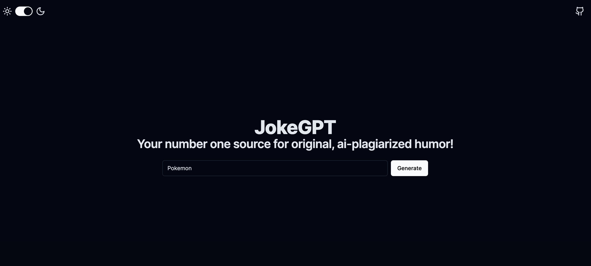

# JokeGPT

JokeGPT is a web application built with Next.js, a popular React-based framework, coupled with an AI backend. It lets users input short prompts and uses them to generate a humorous responses. Behind the scenes, JokeGPT leverages AI language models (trained on a large corpus of internet text) to craft unique jokes based on user prompts.



## Getting Started

First, run the development server:

```bash
npm run dev
# or
yarn dev
# or
pnpm dev
```

## Built With

- NextJS - [https://nextjs.org/](https://nextjs.org/)
- shadcn/ui - [https://ui.shadcn.com/](https://ui.shadcn.com/)
- Replicate - [https://replicate.com/](https://replicate.com/)

## License

JokeGPT is released under the [MIT License](LICENSE).
